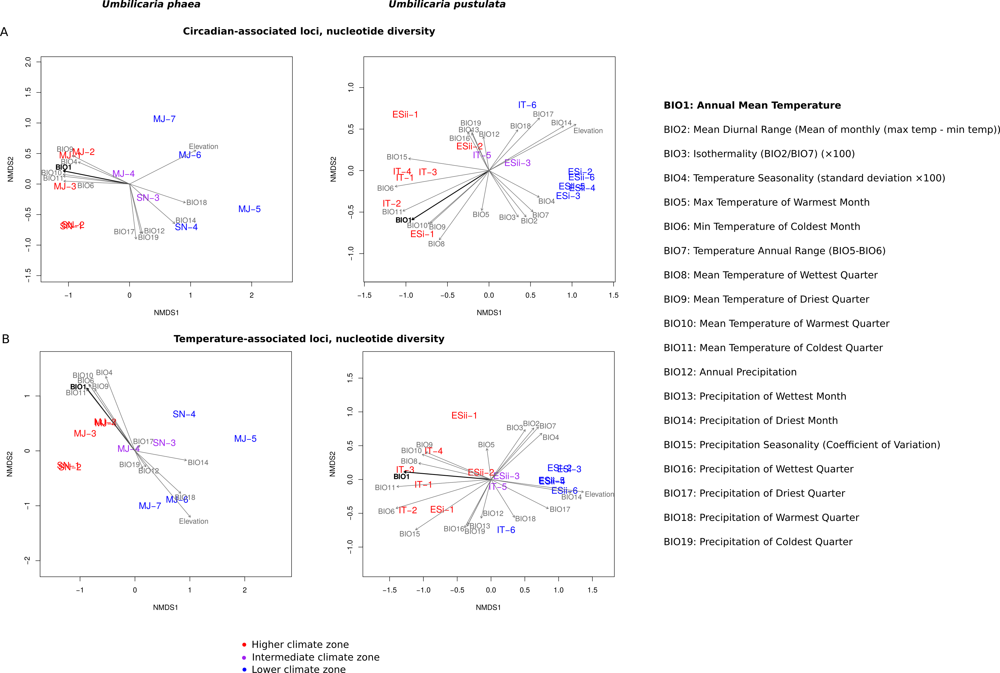

# lichen_circadian_gradients

This repository contains the analyses for the manuscript: 

> Valim H. *, Dal Grande F., Wong E., Schmitt I *. Circadian clock- and temperature-associated genes contribute to overall genomic differentiation along elevation in lichenized fungi.

# Contents

- **Part 1:** pool-seq with popoolation2
- **Part 2:** diversity analysis with popoolation1 and vegan
- **Part 3:** analysis of circadian alleles along elevation gradients
- **Part 4:** dN/dS analysis with HyPhy

# Data availability

Raw sequence reads were deposited in the [European Nucleotide Archive](https://www.ebi.ac.uk/ena/browser/home), under the BioProject PRJEB11664 for the Umbilicaria pustulata reference genome and PRJNA820300 for Umbilicaria phaea reference genome. The data for this study have been deposited in the European Nucleotide Archive (ENA) at EMBL-EBI under accession numbers PRJEB69222 (U. pustulata Spanish gradients), PRJEB11664 (U. pustulata Sardinia gradient) and PRJNA693984 (U. phaea gradients)

# Required software

A full list of the required software, which is also specified within each Part of the analysis.

